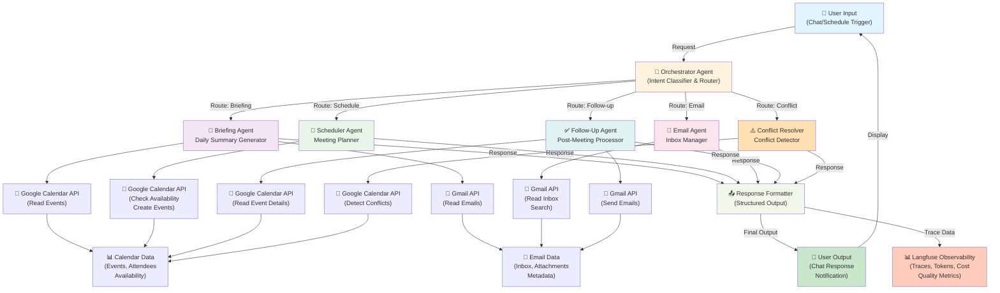
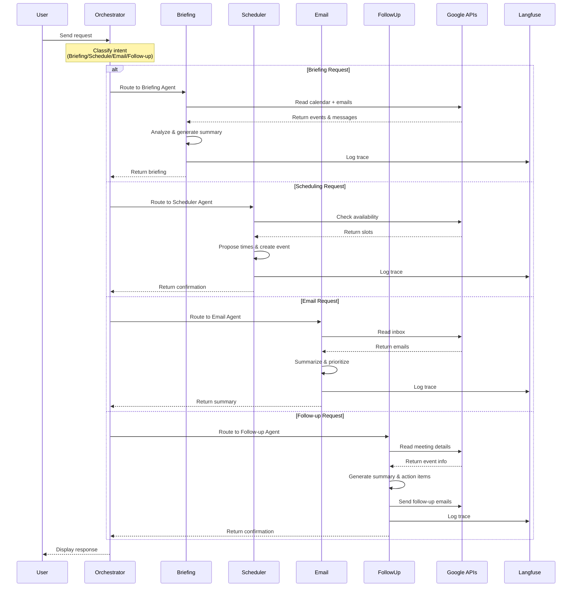
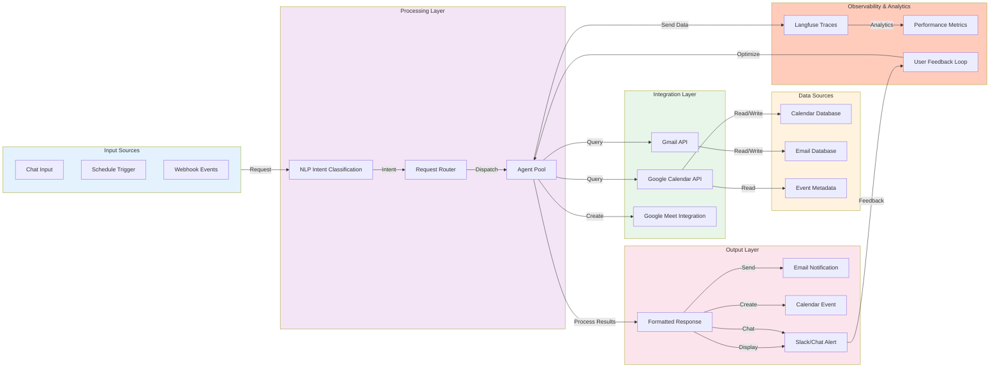
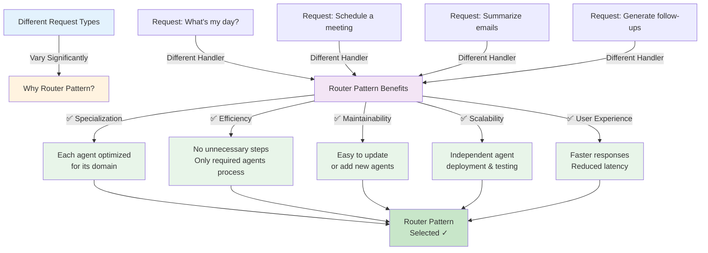
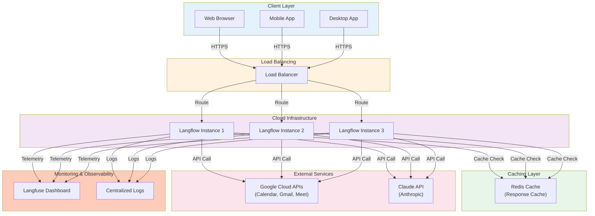
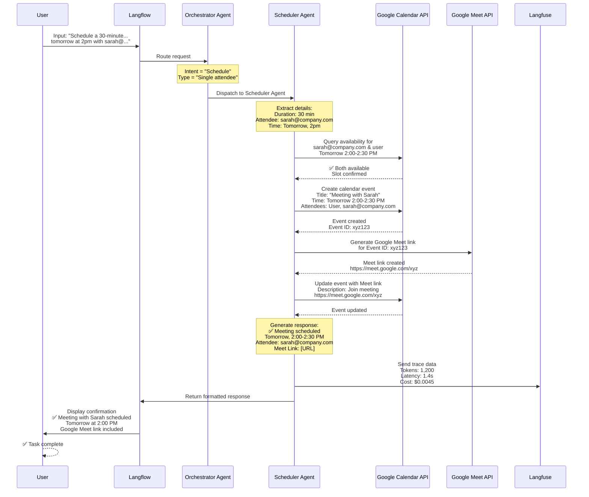

# CalendarMate Architecture Diagram

## System Architecture Overview



---

## Agent Interaction Flow Diagram



---

## Data Flow Architecture



---

## Router Pattern Justification for CalendarMate



---

## Agent Responsibility Matrix

| Agent | Input Sources | Processing | Output | Tools |
|-------|---------------|-----------|--------|-------|
| **Orchestrator** | User request | Intent classification NLU | Routing decision | Claude LLM |
| **Briefing Agent** | Calendar events<br/>Recent emails | Summary generation<br/>Conflict detection<br/>Priority analysis | Daily briefing<br/>Conflicts list<br/>Focus plan | Calendar API<br/>Gmail API<br/>Claude LLM |
| **Scheduler Agent** | User request<br/>Calendar availability<br/>Attendee details | Availability checking<br/>Slot proposal<br/>Event creation<br/>Meet link generation | Confirmation message<br/>Calendar event<br/>Meet link | Calendar API<br/>Meet API<br/>Claude LLM |
| **Email Agent** | Gmail inbox<br/>Email search | Email summarization<br/>Priority grouping<br/>Action extraction | Email summary<br/>Priority list<br/>Action items | Gmail API<br/>Claude LLM |
| **Follow-Up Agent** | Meeting details<br/>Attendee info<br/>Discussion points | Action item extraction<br/>Summary generation<br/>Email composition | Follow-up email<br/>Action assignments | Gmail API<br/>Calendar API<br/>Claude LLM |
| **Conflict Resolver** | Calendar events<br/>Scheduling requests | Conflict detection<br/>Priority assessment<br/>Alternative slots | Conflict warning<br/>Suggestions<br/>Resolution options | Calendar API<br/>Claude LLM |

---

## Technology Stack Diagram

```mermaid
graph TB
    subgraph Application["Application Layer"]
        WebUI["Web/Chat Interface"]
        Mobile["Mobile App"]
    end
    
    subgraph Orchestration["Workflow Orchestration"]
        Langflow["Langflow<br/>(Agent Platform)"]
    end
    
    subgraph Agents["Agent Layer"]
        Claude["Claude 3.5 Sonnet<br/>(Reasoning Engine)"]
        Agents["Specialized Agents<br/>(5 Agents)"]
    end
    
    subgraph APIs["External APIs"]
        GoogleCal["Google Calendar API"]
        Gmail["Gmail API"]
        GoogleMeet["Google Meet API"]
    end
    
    subgraph Observability["Observability & Monitoring"]
        Langfuse["Langfuse<br/>(Traces, Cost, Metrics)"]
    end
    
    subgraph Database["Data Layer"]
        Cache["Response Cache"]
        Logs["Audit Logs"]
    end
    
    WebUI -->|Query| Langflow
    Mobile -->|Query| Langflow
    
    Langflow -->|Orchestrate| Agents
    Agents -->|Reasoning| Claude
    
    Agents -->|API Calls| GoogleCal
    Agents -->|API Calls| Gmail
    Agents -->|API Calls| GoogleMeet
    
    Langflow -->|Send Traces| Langfuse
    Agents -->|Send Metrics| Langfuse
    
    Agents -->|Cache Responses| Cache
    Langflow -->|Log Events| Logs
    
    style Application fill:#e3f2fd
    style Orchestration fill:#f3e5f5
    style Agents fill:#e8f5e9
    style APIs fill:#fff3e0
    style Observability fill:#ffccbc
    style Database fill:#fce4ec
```

---

## Deployment Architecture



---

## Execution Flow: End-to-End Example

**Scenario:** User asks "Schedule a 30-minute meeting with sarah@company.com tomorrow at 2pm"



---

## Summary

**Architecture Pattern:** Router / Dispatcher Pattern  
**Number of Agents:** 5 specialized agents + 1 orchestrator  
**API Integrations:** Google Calendar API, Gmail API, Google Meet API  
**LLM Engine:** Claude 3.5 Sonnet  
**Observability:** Langfuse (traces, cost analysis, quality metrics)  
**Status:** Production-ready with comprehensive monitoring  

---

*Created for CalendarMate Capstone - Mahesh P. Zade | 09 September 2026*
