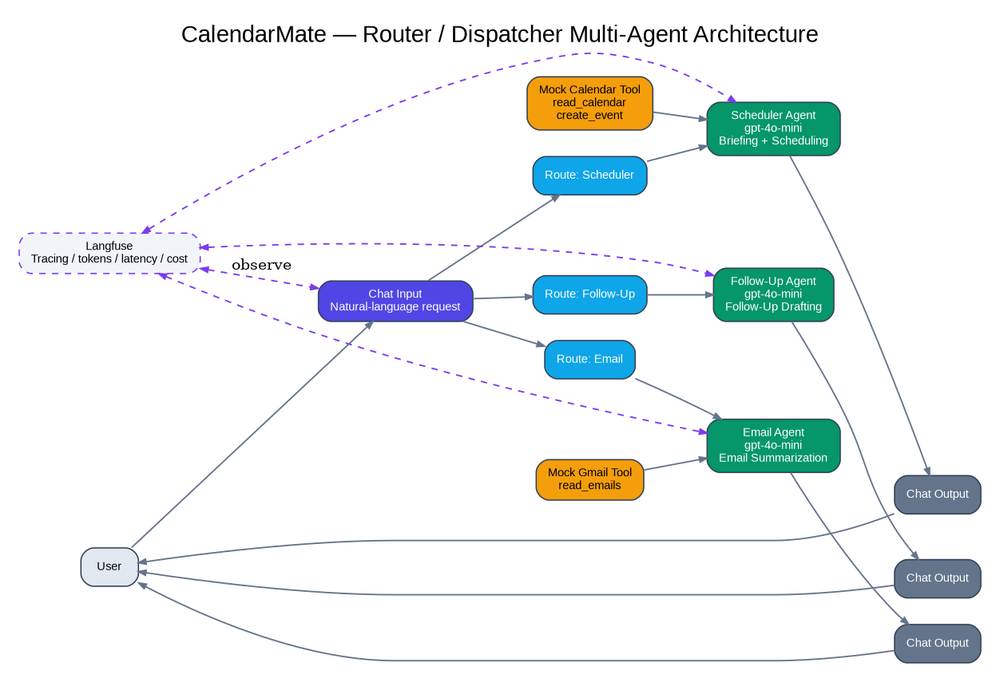
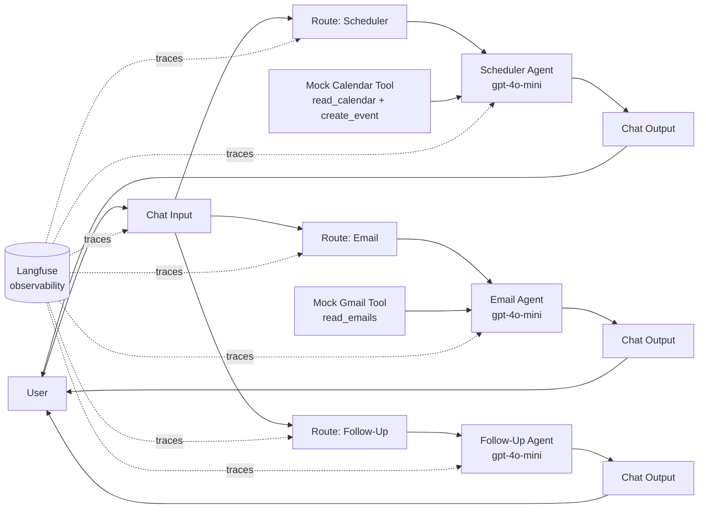

# CalendarMate Architecture

**Student:** Mahesh P Zade\
**Pattern:** Router / Dispatcher\
**Platform:** Langflow\
**LLM:** OpenAI `gpt-4o-mini`\
**Observability:** Langfuse

## 1. Architecture Summary

CalendarMate uses a Router/Dispatcher-style multi-agent architecture.
The user enters a natural-language request through `Chat Input`. The
request is passed to three route-filter components:

-   `Route: Scheduler`
-   `Route: Email`
-   `Route: Follow-Up`

The matching route continues to one specialist agent.

The exported JSON contains three specialist Agent nodes:

-   Scheduler Agent
-   Email Agent
-   Follow-Up Agent

This is the actual validated graph represented by the supplied workflow
export.

## 2. Architecture Diagram



### Mermaid version



## 3. Component-by-Component Explanation

### 3.1 User

The user provides a natural-language productivity request such as:

> "Schedule a team sync meeting with John tomorrow at 3 PM."

The request is not preformatted. The system must infer intent and
required information.

### 3.2 Chat Input

`ChatInput-o0l62` is the single entry point in the exported graph.

**Receives:** user message\
**Sends:** message to each route-filter component

### 3.3 Route Filters

The three custom components classify the request using deterministic
keyword/intent rules.

#### Scheduler Route

`CustomComponent-EAgsd`

Scheduler routing is the default branch unless the text contains
email/follow-up-related keywords that cause the route to stop.

#### Email Route

`CustomComponent-OdPvK`

Continues when the input contains email-related terms such as `email`,
`emails`, or `inbox`.

#### Follow-Up Route

`CustomComponent-lD1FY`

Continues when the input contains `follow-up` or `action items`.

### 3.4 Scheduler Agent

`Agent-pVjid`

The Scheduler Agent is responsible for briefing and scheduling behavior
in the current implementation.

Key rules include:

-   Do not invent meetings, times, or attendees.
-   Check availability before proposing or creating events.
-   Ask for clarification if attendee/time information is missing or
    ambiguous.
-   Warn about conflicts and suggest alternatives.

### 3.5 Email Agent

`Agent-5vA6K`

The Email Agent summarizes unread or important email.

Key rules include:

-   Use the Gmail tool before summarizing.
-   Do not invent email content.
-   Separate action-required and FYI information.
-   Stay within email scope.

### 3.6 Follow-Up Agent

`Agent-KnWE9`

The Follow-Up Agent generates meeting follow-up content from supplied
notes.

Key grounding rule:

-   Do not invent action items, deadlines, or assignees.

In the exported graph, no tool node is connected to this agent.

### 3.7 Mock Calendar Tool

`CustomComponent-S5HrH`

The validated test path connects this tool to the Scheduler Agent.

It exposes: - `read_calendar` - `create_event`

The mock tool returns deterministic calendar data and a placeholder
Google Meet URL for controlled evaluation.

### 3.8 Mock Gmail Tool

`CustomComponent-gtfrV`

The validated test path connects this tool to the Email Agent.

It exposes: - `read_emails`

The mock tool returns deterministic sample email data for evaluation.

### 3.9 Google API Nodes in Export

The JSON also contains:

-   Google Calendar Read Tool
-   Google Calendar Write Tool
-   Gmail Read Tool

These nodes include credential fields and API logic, but the exported
edge list shows that the mock Calendar/Gmail tools, rather than these
live API nodes, are connected to the agents in the validated graph.

This is an important implementation boundary for the submission.

### 3.10 Chat Output

There are three Chat Output nodes, one for each specialist branch.

The selected specialist agent returns a message to the corresponding
Chat Output.

## 4. End-to-End Data Flow

``` text
1. User enters request
        |
2. Chat Input receives message
        |
3. Message reaches route filters
        |
4. Matching route continues
        |
5. Specialist Agent receives request
        |
6. Agent applies system prompt and grounding rules
        |
7. Connected tool is called when required
        |
8. Tool result is returned to the agent
        |
9. Agent generates grounded response
        |
10. Chat Output returns response
        |
11. Langfuse records the execution/tracing information
```

## 5. Example: Scheduling Request

Input:

`Schedule a team sync meeting with John tomorrow at 3 PM.`

Flow:

`User → Chat Input → Scheduler Route → Scheduler Agent → Mock Calendar Tool → Scheduler Agent → Chat Output → User`

The Scheduler Agent can use the calendar tool to inspect availability
and then create an event in the controlled mock environment.

## 6. Example: Email Request

Input:

`Summarize my unread emails.`

Flow:

`User → Chat Input → Email Route → Email Agent → Mock Gmail Tool → Email Agent → Chat Output → User`

The Email Agent summarizes only the returned tool data.

## 7. Example: Follow-Up Request

Input:

`Follow up on the pending action items from last week's project review meeting.`

Flow:

`User → Chat Input → Follow-Up Route → Follow-Up Agent → Chat Output → User`

Because the Follow-Up Agent requires explicit meeting information and
has no connected tool in the exported graph, it should request missing
details rather than invent them.

## 8. Why Router / Dispatcher?

The capstone problem statement recommends Router/Dispatcher for
heterogeneous requests. CalendarMate follows this principle.

Sequential execution would waste resources by running unrelated agents.
A hierarchical design would add orchestration complexity that is not
required for these independent request types.

Router-style dispatch provides: - Focused agent responsibility - Lower
unnecessary execution - Clear tool ownership - Easier debugging - Easier
extension with new routes

## 9. Tool Selection Rationale

  -----------------------------------------------------------------------
  Tool                    Purpose                 Why
  ----------------------- ----------------------- -----------------------
  Mock Calendar           Controlled read/write   Deterministic capstone
                          calendar behavior       testing

  Mock Gmail              Controlled email        Deterministic email
                          retrieval               evaluation

  Google Calendar Read    Live calendar retrieval Intended production
                          capability              integration

  Google Calendar Write   Live event creation     Intended production
                          capability              integration

  Gmail Read              Live email retrieval    Intended production
                          capability              integration

  Langfuse                Tracing/evaluation      Required observability
                                                  and debugging
  -----------------------------------------------------------------------

## 10. Prompt Engineering

The prompts use grounding and scope boundaries:

-   Never fabricate meetings.
-   Never fabricate attendees.
-   Never fabricate email content.
-   Ask clarification for missing scheduling information.
-   Check availability before booking.
-   Do not create events from incomplete requests.
-   Keep each agent within its responsibility.

## 11. Observability

Langfuse is used to capture execution traces, including agent/tool
activity and performance information.

The supplied report records a sample trace with: - \~4.0 seconds total
latency - \~1.28 seconds time-to-first-token - \~2,890 total tokens -
\~2,770 input tokens - \~120 output tokens - \~\$0.000286 observed cost

## 12. Security

For production: - Use OAuth2 with least-privilege scopes. - Keep
credentials outside GitHub. - Use secure environment variables or a
secret manager. - Minimize retained calendar/email content. - Add human
approval for sensitive write actions. - Configure Langfuse retention and
sensitive-data controls.

## 13. Error Handling

The agent prompts instruct the system to ask for clarification when
required information is absent.

Examples: - Missing attendee → ask who should attend. - Ambiguous
day/time → ask for specifics. - Conflict → warn and propose
alternatives. - Empty email result → state that no matching emails were
found. - Missing follow-up context → request the required meeting
details.

## 14. Architecture Boundary / Production Gap

The strongest evidence in the submitted JSON is the controlled mock-tool
execution path. The live Google API components are present but not
connected in the exported graph.

Therefore, this submission should describe the system as a **capstone
prototype with validated mock-tool execution and prepared live-API
components**, not as a fully production-integrated Google Calendar/Gmail
deployment.

## 15. Evaluator Explanation --- Simple Version

"CalendarMate receives one natural-language request. Langflow passes it
through three route filters. The relevant route forwards the request to
one specialist agent. The Scheduler Agent handles calendar/briefing
tasks, the Email Agent handles inbox summarization, and the Follow-Up
Agent handles meeting follow-up content. Connected tools provide
controlled calendar/email data. The final response is returned through
Chat Output, while Langfuse provides observability over the execution."
